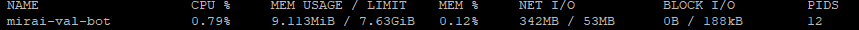
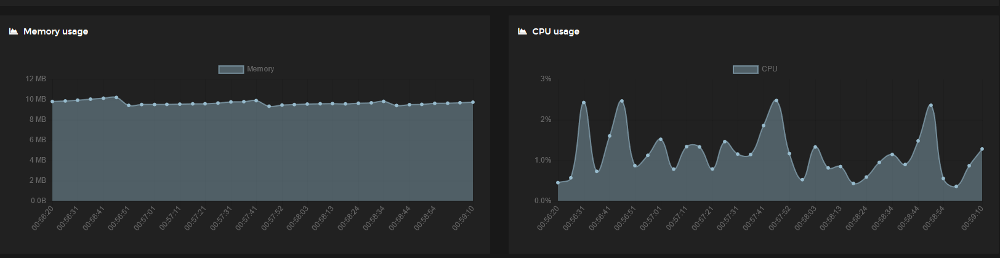

# MiraiValBot

基于 MiraiGo_Template 编写的 瓦群专用QQ bot

## 什么是瓦群？

瓦群全称 泛P家的瓦罗兰特群，是本人一个看Vup + 打瓦的QQ私群，目前只接受看环P家的Vup和经常打瓦的人加入。

此群建立于P家某个V(已引退)的瓦罗兰特参与回后，至今已聚集不少看P家和打瓦的人，每当有P家的瓦参与回时基本上都会团建，平时也会一起开黑。

## 目前内置的功能

- 文字转语音(TTS), 说话
- 基于 `XX是XXX吗？` 的格式随机回答是非题 (可指令设置或基于 Seed 生成)
- 自定义回应(可指令设置)
- 显示撤回的消息(可指令设置开关)
- 随机 @群成员，随机抽一则群精华消息显示，随机抽一则群消息显示
- 透过 @机器人 並说点东西，将会随机发送一则群消息作为回复
- 显示上个月/上年度的今天所设置的群精华消息 (鞭尸用) (可指令设置月还是年)
- 查成分指令(群成员的资料)
- B站开播通知 (可指令设置)
- 高亮用户弹幕/进入直播间/发送SC的通知 (可指令设置)
- 油管开播/预定直播/结束的通知 (可指令设置)
- 推特发文/转发推文/回复推文的通知 (可指令设置)
- 以上通知同步发送到 Discord 特定频道
- 防风控广播重发机制

## 有关广播通知

本机器人的所有通知是基于 Redis PubSub 进行的，因此如果没有负责 publish 的 爬虫服务器的话，本机器人的广播功能基本形同虚设。

负责爬虫的服务器为 [PlatformsCrawler](https://github.com/eric2788/platformscrawler)

### 油管广播内容

- [x] 标题
- [x] 直播封面
- [x] 直播开始时间/预定发布时间
- [x] 直播间链接
- [x] 频道名称

### 推特广播内容

- [x] 推文
- [x] 推文附带链接
- [x] 转发推文 + 附文
- [x] 回复推文链接
- [x] 推文图片
- [x] 推文视频

### B站广播内容

- [x] 直播封面
- [x] 直播标题
- [x] 直播间名称
- [x] 用户名称
- [x] 弹幕内容
- [x] 醒目留言内容
- [x] 直播间链接

## 性能

`RaspberryPi 4B 8GB linux/arm64/v8`

## Docker 部署

[docker.io](https://hub.docker.com/r/eric1008818/mirai-val-bot)

